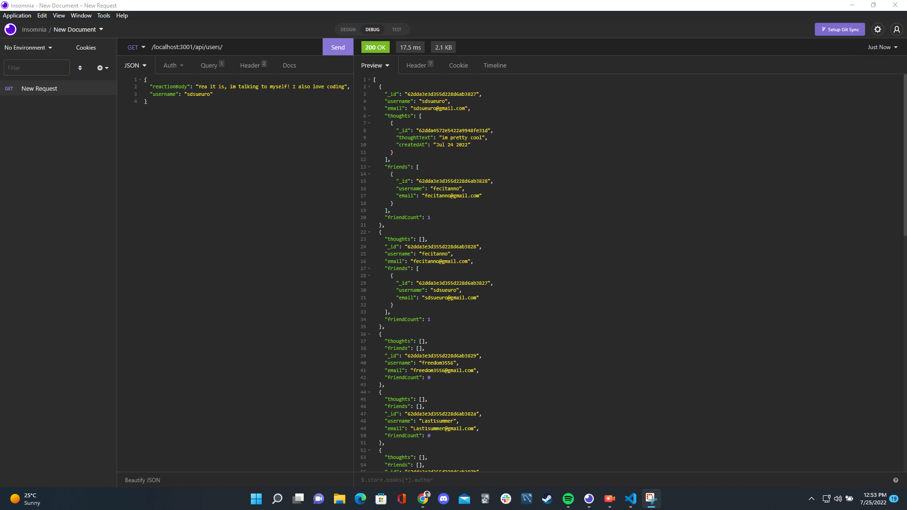
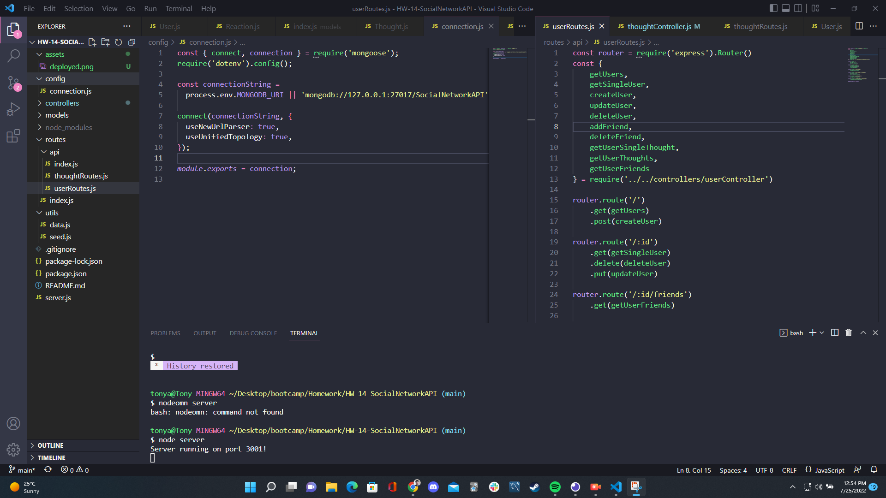

# HW-14-SocialNetworkAPI
A NoSql backend for a social network app using Express and Node

## Table of Contents
- [Introduction](#introduction)
- [Application Preview](#application-preview)
- [Tech Stack](#tech-stack)
- [Installation](#installation)
- [Project Notes](#project-notes)

## Introduction
A social network API for storing user data and interactions. These interactions include being able to add users as friends, being able to post their thoughts, and being able to reply to those thoughts- defined as reactions. Data consists of 2 'parent' tables, users and thoughts, and a 'child' table, reactions, and queries to grab this data are handled through a series of express CRUD routes.

## Application Preview

## Tech Stack
Technologies used includes:
1. NoSql (MongoDB/Mongoose)
2. Expressjs
3. Nodejs

## Installation
Click on the video below for installation instructions.

## Project Notes
1. For a bigger project with a frontend, need better error handling. Need to be more specific on errors.